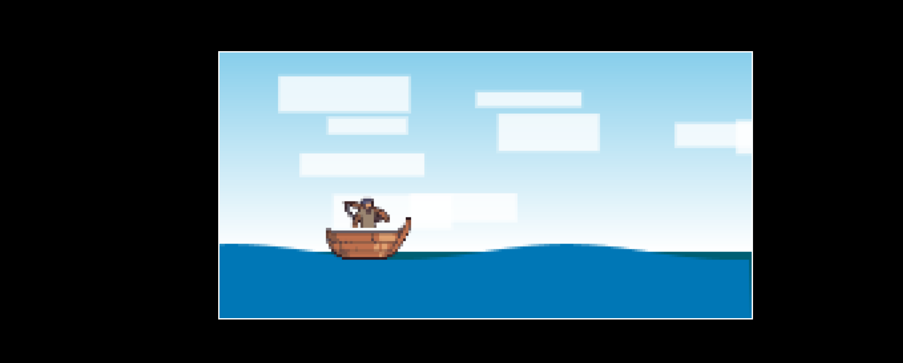

# waves-and-clouds
#  Endless Ocean

**Endless Ocean** is a lightweight HTML5 Canvas animation project that simulates a stylized ocean scene with flowing waves and drifting clouds. Built using only HTML, CSS, and JavaScript — no frameworks or libraries required.

---

##  Features

- Smooth **animated ocean waves** created with sine wave math
- Soft **clouds** floating across the sky
- Minimal, centered layout with a dark aesthetic
- Responsive design for any screen size

---

##  Preview

 

---

## Getting Started

Clone the repository and open `index.html` in your browser:

## bash
git clone https://github.com/your-username/endless-ocean.git
cd endless-ocean
open index.html  # or just double-click it

## How It Works

 Waves are drawn using a sine function across the canvas.

 Clouds are rendered as overlapping circles and move horizontally with variable speeds.

 The animation loop updates both elements smoothly using requestAnimationFrame.

##  Art Credits

- **Fishing Game Assets (Pixel Art)** by [ansimuz](https://ansimuz.itch.io/)
  - Source: [OpenGameArt.org](https://opengameart.org/content/fishing-game-assets-pixel-art)
